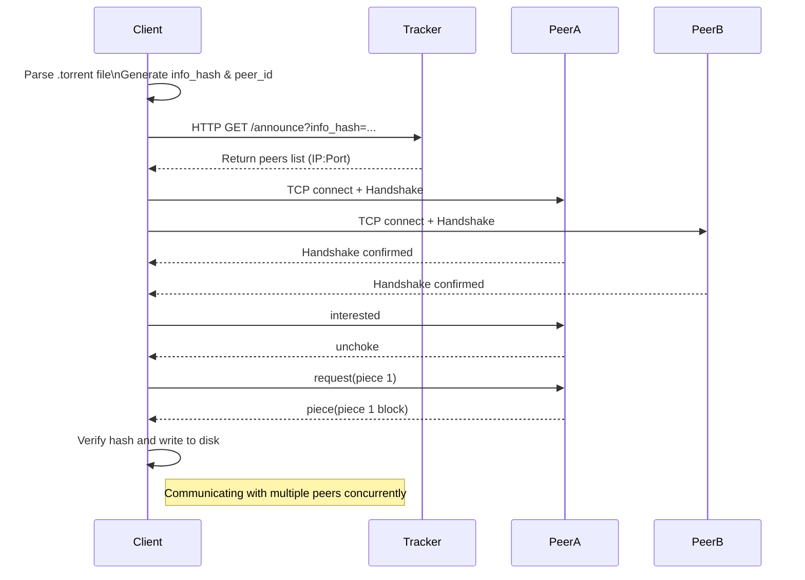

# Torrent Client

BitTorrent is a protocol for downloading and distributing files across the Internet. It enables efficient file sharing by dividing files into smaller pieces and downloading them from multiple peers simultaneously.

## Protocol Overview

1. **Torrent File Parsing**: The client parses the `.torrent` file to extract metadata, including the tracker URL, file information, and piece hashes.
2. **Tracker Communication**: The client communicates with the tracker to obtain a list of peers participating in the file sharing.
3. **Peer Communication**: The client establishes connections with peers, performs a handshake, and exchanges bitfields to determine available pieces.
4. **Piece Downloading**: The client requests pieces from peers, verifies their integrity using hashes, and writes them to disk.
5. **Concurrent Downloads**: The client downloads pieces from multiple peers concurrently to maximize efficiency.

