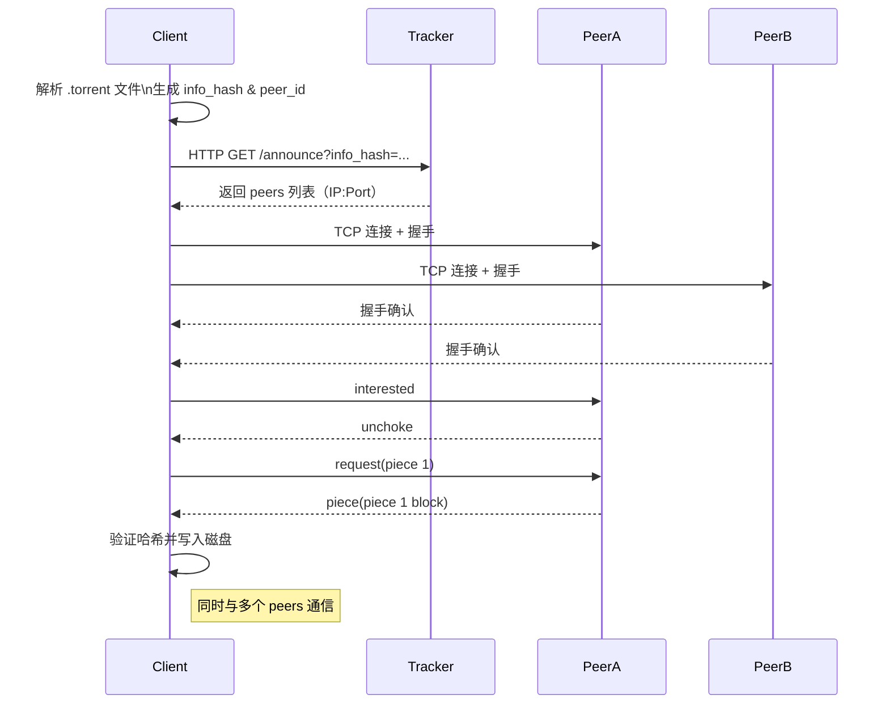

BitTorrent is a protocol for downloading and distributing files across the Internet.

```mermaid
sequenceDiagram
    participant Client
    participant Tracker
    participant PeerA
    participant PeerB

    Client->>Client: 解析 .torrent 文件\n生成 info_hash & peer_id
    Client->>Tracker: HTTP GET /announce?info_hash=...
    Tracker-->>Client: 返回 peers 列表（IP:Port）

    Client->>PeerA: TCP 连接 + 握手
    Client->>PeerB: TCP 连接 + 握手

    PeerA-->>Client: 握手确认
    PeerB-->>Client: 握手确认

    Client->>PeerA: interested
    PeerA-->>Client: unchoke

    Client->>PeerA: request(piece 1)
    PeerA-->>Client: piece(piece 1 block)

    Client->>Client: 验证哈希并写入磁盘

    Note right of Client: 同时与多个 peers 通信
```
